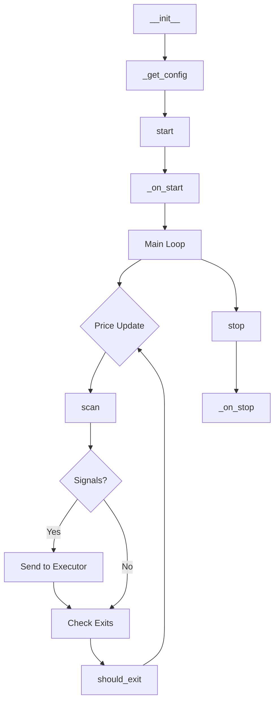

# Building Custom Strategies

PolyBot's strategy system is designed for extensibility. Every strategy inherits from `BaseStrategy` and implements two core methods.

## The BaseStrategy Interface

```python
from polybot.strategies.base import BaseStrategy, StrategyConfig
from polybot.models.messages import PriceUpdate, Signal, SignalAction
from polybot.models.position import Position

class MyStrategy(BaseStrategy):
    """Custom strategy implementation."""
    
    name = "my_strategy"
    description = "My custom trading strategy"
    
    def _get_config(self) -> StrategyConfig:
        """Return strategy-specific configuration."""
        return StrategyConfig(
            max_position_size=100.0,
            max_positions=5,
        )
    
    async def scan(self, update: PriceUpdate) -> list[Signal]:
        """Analyze price update and generate trading signals.
        
        This method is called for every price update from the scanner.
        Return an empty list if no opportunity is found.
        
        Args:
            update: Real-time price data including bid, ask, mid, volume
            
        Returns:
            List of Signal objects to send to the executor
        """
        # Your alpha logic here
        if self._detect_opportunity(update):
            return [Signal(
                strategy=self.name,
                market_id=update.market_id,
                token_id=update.token_id,
                action=SignalAction.BUY_YES,
                price=update.ask,
                size=50.0,
                reason="Custom signal reason",
                confidence=0.85,
            )]
        return []
    
    async def should_exit(self, position: Position, update: PriceUpdate) -> bool:
        """Determine if an open position should be closed.
        
        Called for each position when its market receives a price update.
        
        Args:
            position: Current open position
            update: Latest price data
            
        Returns:
            True to close the position, False to hold
        """
        # Exit on 10% profit or 5% loss
        pnl_pct = position.unrealized_pnl / position.cost_basis
        return pnl_pct > 0.10 or pnl_pct < -0.05
```

## Required Methods

### `_get_config() -> StrategyConfig`

Returns the strategy's configuration. The base `StrategyConfig` includes:

| Field | Type | Default | Description |
|-------|------|---------|-------------|
| `max_position_size` | float | 100.0 | Max size per position in USD |
| `max_positions` | int | 10 | Max concurrent positions |

You can extend this with custom config classes.

### `scan(update: PriceUpdate) -> list[Signal]`

Called on every price update. This is where your alpha logic lives.

**PriceUpdate fields:**

| Field | Type | Description |
|-------|------|-------------|
| `market_id` | str | Market condition ID |
| `token_id` | str | Token ID (YES or NO) |
| `bid` | float | Best bid price |
| `ask` | float | Best ask price |
| `mid` | float | Mid price |
| `volume` | float | Recent volume |
| `timestamp` | int | Unix timestamp |

**Signal fields:**

| Field | Type | Description |
|-------|------|-------------|
| `strategy` | str | Your strategy name |
| `market_id` | str | Target market |
| `token_id` | str | Target token |
| `action` | SignalAction | BUY_YES, BUY_NO, CLOSE |
| `price` | float | Target price |
| `size` | float | Order size in USD |
| `reason` | str | Human-readable reason |
| `confidence` | float | 0-1 confidence score |

### `should_exit(position, update) -> bool`

Called for each open position when its market updates. Return `True` to close.

## Strategy Lifecycle



## Optional Hooks

Override these for custom initialization/cleanup:

```python
async def _on_start(self) -> None:
    """Called when strategy starts. Load models, connect to APIs."""
    self.model = await load_my_model()

async def _on_stop(self) -> None:
    """Called when strategy stops. Save state, cleanup."""
    await self.model.close()
```

## Accessing Services

Strategies have access to several clients:

```python
# Get cached prices
price = self.get_price(token_id)

# Get current position
position = self.get_position(market_id, token_id)

# Check if we have any position in market
has_pos = self.has_position(market_id)

# Query markets from SQLite
markets = await self._sqlite.get_active_markets(limit=100)
```

## Registering Your Strategy

Add to `src/polybot/strategies/__init__.py`:

```python
from polybot.strategies.my_strategy import MyStrategy

STRATEGY_REGISTRY = {
    # ... existing strategies
    "my_strategy": MyStrategy,
}
```

Then enable via CLI:
```bash
polybot strategy enable my_strategy
```

## Custom Configuration

For strategy-specific settings:

```python
from pydantic_settings import BaseSettings

class MyStrategyConfig(BaseSettings):
    model_config = SettingsConfigDict(env_prefix="MY_STRATEGY_")
    
    threshold: float = 0.05
    lookback_hours: int = 24
    
class MyStrategy(BaseStrategy):
    def _get_config(self) -> StrategyConfig:
        # Load custom config
        self._custom_config = MyStrategyConfig()
        return StrategyConfig(
            max_position_size=self._custom_config.max_size,
        )
```

## Testing Strategies

```python
# tests/strategies/test_my_strategy.py
import pytest
from polybot.strategies.my_strategy import MyStrategy
from polybot.models.messages import PriceUpdate

@pytest.fixture
def strategy():
    return MyStrategy()

@pytest.fixture
def price_update():
    return PriceUpdate(
        market_id="0x123",
        token_id="456",
        bid=0.45,
        ask=0.46,
        mid=0.455,
        volume=1000.0,
        timestamp=1234567890,
    )

async def test_scan_no_opportunity(strategy, price_update):
    """Test scan returns empty when no opportunity."""
    signals = await strategy.scan(price_update)
    assert signals == []

async def test_scan_finds_opportunity(strategy, price_update):
    """Test scan finds opportunity when conditions met."""
    # Set up conditions for your strategy
    price_update.mid = 0.30  # Example condition
    signals = await strategy.scan(price_update)
    assert len(signals) == 1
    assert signals[0].action == SignalAction.BUY_YES
```

Run tests:
```bash
uv run pytest tests/strategies/test_my_strategy.py -v
```

## Example: Simple Mean Reversion

```python
class MeanReversionStrategy(BaseStrategy):
    """Buy when price drops below moving average."""
    
    name = "mean_reversion"
    description = "Mean reversion on price deviations"
    
    def __init__(self, settings=None):
        super().__init__(settings)
        self._price_history: dict[str, list[float]] = {}
        self._lookback = 20
        self._threshold = 0.05  # 5% deviation
    
    def _get_config(self) -> StrategyConfig:
        return StrategyConfig(max_position_size=100.0)
    
    async def scan(self, update: PriceUpdate) -> list[Signal]:
        # Track price history
        if update.token_id not in self._price_history:
            self._price_history[update.token_id] = []
        
        history = self._price_history[update.token_id]
        history.append(update.mid)
        
        # Keep only lookback period
        if len(history) > self._lookback:
            history.pop(0)
        
        # Need enough history
        if len(history) < self._lookback:
            return []
        
        # Calculate mean
        mean = sum(history) / len(history)
        deviation = (update.mid - mean) / mean
        
        # Buy if price is below mean by threshold
        if deviation < -self._threshold and not self.has_position(update.market_id):
            return [Signal(
                strategy=self.name,
                market_id=update.market_id,
                token_id=update.token_id,
                action=SignalAction.BUY_YES,
                price=update.ask,
                size=50.0,
                reason=f"Price {deviation:.1%} below mean",
                confidence=min(abs(deviation) / self._threshold, 1.0),
            )]
        
        return []
    
    async def should_exit(self, position: Position, update: PriceUpdate) -> bool:
        # Exit when price returns to mean
        history = self._price_history.get(update.token_id, [])
        if len(history) < self._lookback:
            return False
        
        mean = sum(history) / len(history)
        return update.mid >= mean
```

## Best Practices

1. **Start with shadow mode**: Always test without real money first
2. **Log signals**: Use `self._logger.info()` for debugging
3. **Handle edge cases**: Check for None values, empty data
4. **Respect rate limits**: Don't spam the executor with signals
5. **Use confidence scores**: Help the executor prioritize
6. **Write tests**: Cover your alpha logic with unit tests
